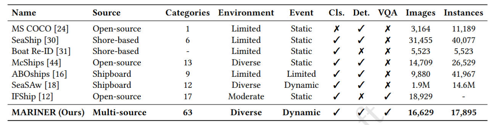
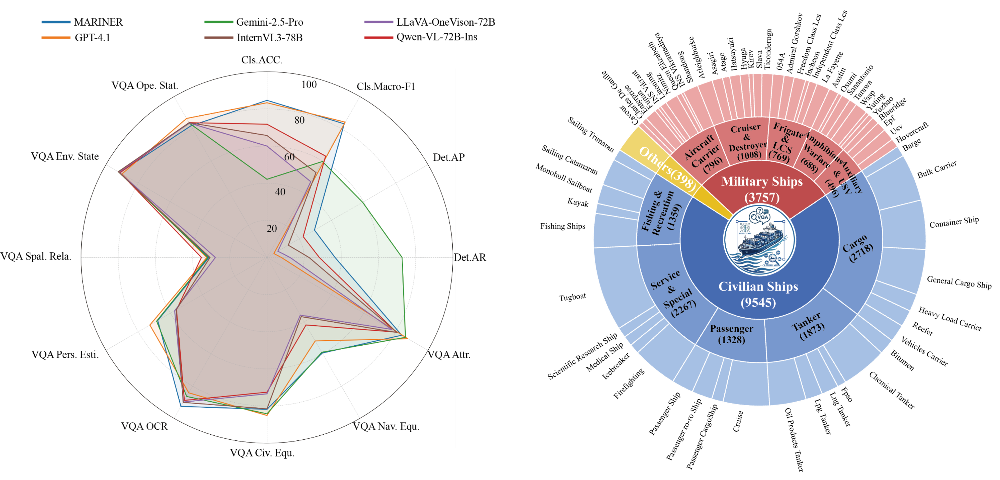

# MARINER: A 3E-Driven Benchmark for Fine-Grained Perception and Complex Reasoning in Open-Water Environments

## 🔥🔥🔥 News !!
 <ul style="padding-left: 1.2em; margin: 0 0 1.8em 0; list-style: none;">
  <li style="margin-bottom: 1em; display: flex; align-items: flex-start; gap: 0.6em;">
      <span style="color: #666; font-size: 0.9em;">[2026/04/06]</span>
      <span>👋</span>
      <span>Upload appendix. 
        <a href="https://github.com/lxixim/MARINER/blob/main/Appendix/Appendix.pdf" 
           target="_blank" 
           rel="noopener noreferrer"
           style="color: #1a73e8; text-decoration: none; font-weight: 500;">
           Appendix.
        </a>
      </span>
    </li>
    <li style="margin-bottom: 1em; display: flex; align-items: flex-start; gap: 0.6em;">
      <span style="color: #666; font-size: 0.9em;">[2026/04/06]</span>
      <span>👋</span>
      <span>Release Datasets. 
        <a href="https://huggingface.co/datasets/lxixim/MARINER" 
           target="_blank" 
           rel="noopener noreferrer"
           style="color: #1a73e8; text-decoration: none; font-weight: 500;">
          🤗Test Dataset.
        </a>
       Due to project requirements, the training set needs to be applied for.
      </span>
    </li>
    <li style="margin-bottom: 1em; display: flex; align-items: flex-start; gap: 0.6em;">
      <span style="color: #666; font-size: 0.9em;">[2026/04/06]</span>
      <span>👋</span>
      <span>Unupload paper. 
        <a href="https://arxiv.org/abs/XXXX.XXXXX" 
           target="_blank" 
           rel="noopener noreferrer"
           style="color: #1a73e8; text-decoration: none; font-weight: 500;">
          Arxiv.
        </a>
      </span>
    </li>
  </ul>


## 🌟 Overview

MARINER evaluates Multimodal Large Language Models (MLLMs) across three progressive dimensions: Perception (fine-grained classification, object detection), Spatial Understanding (viewpoint estimation, spatial relationships), and Reasoning (environmental state inference, operational status judgment). Built upon an innovative "Entity-Environment-Event" (3E) paradigm, this benchmark comprises 16,629 images from diverse sources, covering 63 fine-grained vessel categories, 4 types of harsh weather conditions, and 5 typical dynamic maritime events. MARINER provides a comprehensive evaluation of mainstream MLLMs through 3 task categories and multiple metrics, revealing that even state-of-the-art models face significant challenges in performing fine-grained discrimination and causal reasoning within complex maritime scenarios.


Comparison of ship-related datasets in terms of source diversity, category scale, environmental coverage, event representation, task coverage, and dataset scale. 


## ✨ Data Construct

MARINER is built under the novel Entity-Environment-Event (3E) paradigm, comprising 16,629 multi-source maritime images. The dataset covers 63 fine-grained vessel categories (Entity), diverse adverse environments including fog, rain, low-light, and glare conditions (Environment), and 5 typical dynamic maritime incidents such as collisions, capsizing, and fires (Event). The benchmark spans three core tasks: fine-grained classification, object detection, and visual question answering, enabling comprehensive evaluation of multimodal models in open-water scenarios.



## 📊 Benchmark Statistics
🧪Model Evaluation. A diverse set of Multimodal Large Language Models (MLLMs) is evaluated on MARINER to assess maritime fine-grained perception and reasoning capabilities across various architectures, scales, and training paradigms. The evaluation encompasses the following model categories:

🔒Proprietary Models: Advanced private models, including GPT-4o, GPT-4.1, Gemini-2.5-Flash, and Gemini-2.5-Pro-Thinking, are included to establish performance upper bounds.

🌐Open-Source Models: Extensive evaluations are conducted on 16 representative models with parameters ranging from 1.5B to 72B, such as Qwen2.5-VL, InternVL2/3, MiniCPM-V-2.6, and LLaVA-OneVision.

🎨Task-Specific Baselines: The proposed MARINER-7B model is benchmarked against scale-matched open-source variants to demonstrate the effectiveness of domain-specific adaptation.

Detailed evaluation metrics for the three core tasks—classification, detection, and VQA—along with additional implementation details, are provided in the Appendix.

## 📁 QucikStart
```text
MARINER/
├── 📂docs/                # Project page source code
├── 📂Appendix/                 # The appendix of the article
├── 📄train_7B_classify.py    # Qwen2.5-VL-7B-Instruct classification task training code      
├── 📄inference_classify.py       # Inference code for classification tasks
├── 📄evaluate_classify.py      # Classification task evaluation code
├── 📄requirements.txt     # Dependencies for evaluation
└── 📄README.md
```

## 🧪 Usage
This section demonstrates how to use our evaluation script to test different tasks. Here we take the MARINER classification task as an example.

**I. Environment Setup.**
```bash
# Clone the repository
git clone https://github.com/lxixim/MARINER.git
cd MARINER

# Create a new environment
conda create -n mariner python==3.10
conda activate mariner

# Install dependencies
pip install -r requirements.txt
```

**II. Download the dataset.**

Download the dataset from our HuggingFace repository.

```bash
# Download the dataset from Hugging Face.
git clone https://huggingface.co/datasets/viviwang/MARINER
```

**III. Classification task training.**

Train a classification model.

```bash
python your_script_name.py \
    --model_name "Qwen2.5-VL-7B-Instruct" \
    --model_root "<PATH_TO_MODELS_FOLDER>" \
    --image_root "<PATH_TO_YOUR_TRAINING_IMAGES>" \
    --json_root "<PATH_TO_YOUR_ANNOTATION_JSON_FOLDER>" \
    --output_root "<PATH_TO_SAVE_CHECKPOINTS>" \
    --lora_r 64 \
    --lora_alpha 128 \
    --num_train_epochs 3 \
    --per_device_train_batch_size 4 \
    --gradient_accumulation_steps 8 \
    --learning_rate 2e-5 \
    --max_length 2048
```

**IV. Classification task reasoning.**

Inference for a classification task.

```bash
python inference_classify.py
```

**V. Classification task evaluation.**

Evaluation for a classification task.

```bash
python evaluate_classify.py
```
