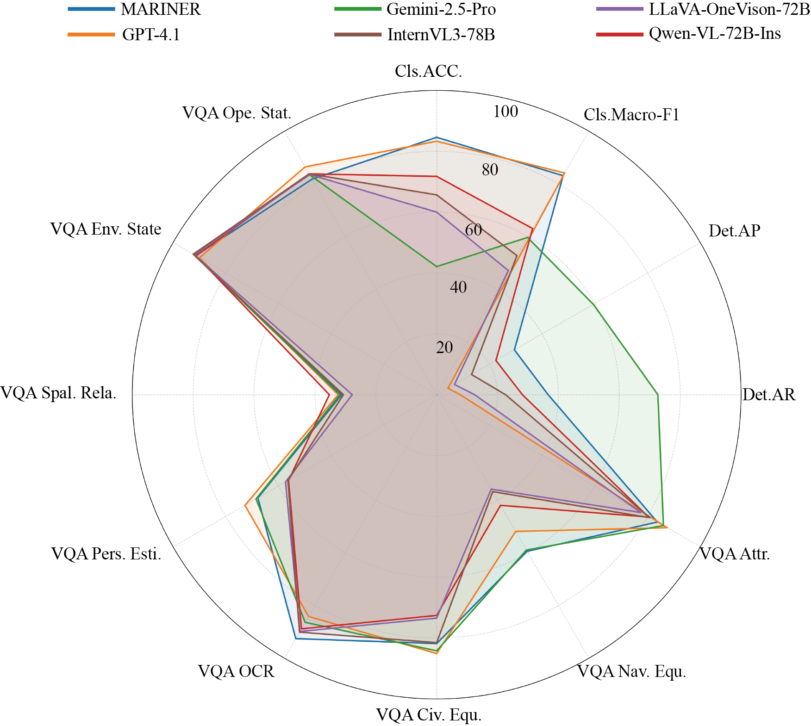
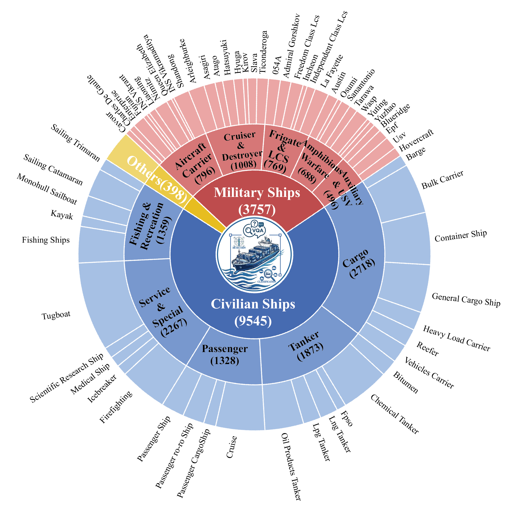

# MARINER: A 3E-Driven Benchmark for Fine-Grained Perception and Complex Reasoning in Open-Water Environments

## 🌟 Overview  🌟 概述

MARINER evaluates Multimodal Large Language Models (MLLMs) across three progressive dimensions: Perception (fine-grained classification, object detection), Spatial Understanding (viewpoint estimation, spatial relationships), and Reasoning (environmental state inference, operational status judgment). Built upon an innovative "Entity-Environment-Event" (3E) paradigm, this benchmark comprises 16,629 images from diverse sources, covering 63 fine-grained vessel categories, 4 types of harsh weather conditions, and 5 typical dynamic maritime events. MARINER provides a comprehensive evaluation of mainstream MLLMs through 3 task categories and multiple metrics, revealing that even state-of-the-art models face significant challenges in performing fine-grained discrimination and causal reasoning within complex maritime scenarios.

  
  

## 先改哪里

优先改这些位置：

1. `docs/index.html` 里的论文标题、作者、单位、venue。
2. 顶部按钮链接：`Paper`、`arXiv`、`Code`、`Dataset`、`Demo Video`、`Appendix`。
3. 摘要段落。
4. `Overview / Method / Results / FAQ / Acknowledgement` 的占位文字。
5. `BibTeX` 和 `Contact`。

## 图片替换建议

当前占位图文件如下：

- `imgs/all_radar.png`
- `docs/static/img/overview-placeholder.svg`
- `docs/static/img/method-placeholder.svg`
- `docs/static/img/results-placeholder-a.svg`
- `docs/static/img/results-placeholder-b.svg`
- `docs/static/img/video-placeholder.svg`

最简单的替换方式：

1. 保持文件名不变，直接用你的图片覆盖这些文件。
2. 或者新增图片文件，然后在 `docs/index.html` 里把对应 `src` 改掉。

推荐格式：

- 普通展示图：`.png` 或 `.jpg`
- 线稿/流程图：`.svg`
- teaser 或 demo 封面：宽图优先

## GitHub Pages 发布

仓库推送到 GitHub 后：

1. 打开仓库 `Settings`
2. 进入 `Pages`
3. 选择 `Deploy from a branch`
4. Branch 选 `main`
5. Folder 选 `/docs`
6. 保存

发布后地址一般是：

`https://你的用户名.github.io/仓库名/`

## 后续可继续补的内容

- 嵌入 YouTube / Bilibili 视频
- 加作者主页链接
- 加 Google Scholar / GitHub 图标
- 加结果表格或 benchmark leaderboard
- 加 poster、slides、supplementary 下载入口

## 本地预览

这是纯静态页面，直接双击 `docs/index.html` 就能看。

如果你后面要我继续，我可以直接帮你做这几类增强：

- 改成更接近顶会论文项目页的排版风格
- 把按钮和作者区换成带图标的版本
- 加视频嵌入
- 加结果表格
- 加中英文双语版本
